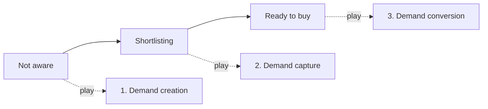

# The three GTM plays, by buyer state

**Source:** Tim Carden, RevenueFlow (revenueflow.com). Filed 2026-08-04. **Jan endorsed this framework explicitly** — use it as the default lens when framing GTM strategy, diagnosing a leaking motion, or recommending what to build next.

**What it is:** a segmentation of the market by *buyer state* rather than by channel or funnel stage. Every account sits in one of three states at any moment, and each state needs a structurally different play. Running the wrong play at a state is not "less effective", it actively burns the audience.

## The load-bearing insight

**Buyers do not move through these states in order, and they do not wait for you.** At any moment your TAM is split across all three. So the three plays are not a sequence you graduate through, they are three systems you run **concurrently**. Pick one and skip the others and the motion leaks: demand creation without capture builds awareness someone else converts; capture without creation fishes an ever-shrinking in-market pool; conversion without either has nothing to convert.

This is the part to lead with when someone asks "should we do content or outbound?" The question is malformed.

## The three plays

| | 1. Demand creation | 2. Demand capture | 3. Demand conversion |
|---|---|---|---|
| **Buyer state** | Not looking yet | Comparing options now | Ready to move |
| **The job** | Plant the problem early so you are the trusted name when they do start looking. Depth beats volume | Appear at the moment the search starts, with the trigger stated in the opening line. Shortlists form in days, not quarters | Compress the gap between first reply and booked meeting. Delay bleeds intent by the hour |
| **Plays to run** | Founder-led content engine; niche teardowns and data posts; educational email sequences; presence in industry communities | Signal-based outbound; hiring / funding / tech-stack triggers; honest comparison content | Speed-to-lead automation; pipeline reactivation; case-study proof up front; risk-reversal offer |
| **Typical stack** | LinkedIn, beehiiv, YouTube | Clay, Apollo, Smartlead | Cal.com, HubSpot, Slack |
| **Metric to watch** | Branded search volume and inbound DMs | Reply rate on triggered sends (not on all sends) | Time from reply to booked meeting |
| **The dead end** | Pitching a demo to a cold audience. Burns the list before it warms. At this state you are asking for attention, not for a meeting | One sequence blasted at the whole TAM. An in-market buyer detects it in one line. No trigger in the opener means no reply | A ready buyer parked in the CRM for three days. They book with whoever answers first. Response time is the cheapest fix in the whole motion |

## Worked detail

**Capture — the opener carries the trigger.** The example pattern is: name the observed signal, then ask one question tied to the consequence of that signal. Shape: *"Saw the 3 SDR openings. Before they ramp, one question..."* The trigger is in the first sentence, before any claim about the product.

**Conversion — the target is a minutes-scale loop, not a day-scale one.** The reference timeline from a positive reply to a held calendar slot is about four minutes: reply lands → lead routed and context pulled → follow-up drafted and sent → times offered and calendar held. Anything measured in hours is already leaking; anything in days is a lost deal to whoever was faster.

## How to use it in this skill

- **Diagnosis.** Pairs with `{SKILL_BASE}/reference/funnel-bottleneck-diagnosis.md`. That file finds *which machine is slow*; this one names *which play repairs it*. Run the bottleneck diagnosis first, then pick the play for the state that machine serves.
- **Strategy requests.** When asked "what should we do / where should we invest", check coverage across all three states before recommending depth in one. A motion missing an entire state is a bigger finding than an underperforming channel.
- **Cluster routing.** Demand creation → `clusters/content-marketing`, `clusters/linkedin-organic`. Demand capture → `clusters/signals`, `clusters/list-building`, `clusters/cold-email`. Demand conversion → `clusters/campaign-ops` (score-meeting-intent, analyze-replies), `clusters/revops` (handoffs-and-lead-routing, speed-to-lead SLAs), `clusters/objections`.
- **Do not present the three as a funnel.** The framework's whole point is that they are concurrent. Drawing them as sequential stages inverts the conclusion.
