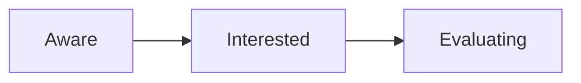

# Awareness Scoring Matrix: How Top GTM Teams Score Awareness

**What this shows:** A company-by-stage matrix of how three GTM teams (Clay, Parabola, Userpilot) define signal criteria for each awareness stage (Aware, Interested, Evaluating). Each company's criteria reflect its primary GTM motion; criteria within a stage are OR conditions (any one signal qualifies the account for that stage).

## Detail notes

### Stage criteria matrix

Criteria within a cell are joined by OR: any single signal moves the account into that stage.

| Company | Primary GTM Motion | Aware | Interested | Evaluating |
|---|---|---|---|---|
| Clay | Content, PLG, Community | Website visit (last 30 days) OR 2+ contacts connected with co-founders OR 1+ engagement on social content OR attended a low-intent event OR intro call from investors | Created a workspace OR high-intent webpage OR positive outbound reply OR attended a high-intent event | Contact sales form OR discovery meeting |
| Parabola | Outbound, PLG, Community | Website visit (last 30 days) OR 2+ contacts connected with CEO OR 2 contacts with 2+ email opens (last 30 days) OR 1 contact with 1+ email click (last 30 days) OR is a member of community | Trial start OR high-intent webpage visit OR event attendance OR dinner attendance OR webinar attendance | Demo requested OR demo booked |
| Userpilot | Content, SEO, LinkedIn Ads | 50+ LinkedIn ad impressions | 5+ LinkedIn Ad impressions (last 90 days) OR 1+ LinkedIn ad engagements (last 90 days) OR UX audit OR 3+ webinar attendances | Trial sign-up OR demo booked |

### Patterns worth copying

- **Criteria mirror the motion.** Clay (community-led) counts social engagement and co-founder connections; Parabola (outbound-led) counts email opens and clicks; Userpilot (ads-led) counts LinkedIn ad impressions and engagements.
- **Recency windows are explicit:** 30 days for website and email signals, 90 days for ad signals.
- **Aware is cheap and broad** (impressions, visits, connections); **Interested requires action** (workspace created, trial start, ad engagement, event attendance); **Evaluating is hand-raise only** (sales form, demo, trial sign-up).
- **Relationship signals count:** contacts connected with co-founders or the CEO are treated as awareness signals, not just behavioral events.

### Tool stack by function

| Function | Tools |
|---|---|
| Website Visits | HubSpot, Warmly |
| TAL Sourcing | Sales Nav, Clay |
| Manual Outreach | Outreach.io, Salesloft |
| Automated Outreach | Instantly, HeyReach |
| Ad Tracking | Fibbler, ZenABM |
| Community | Slack, Skool |
| Webinars | Sequel.io, lu.ma |
| CDPs | Segment, RudderStack |
| Marketing Automation | HubSpot, ActiveCampaign |
| Social Signals | Trigify, Clay |
