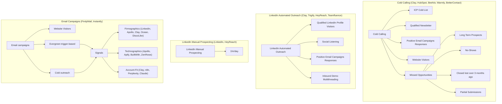

# Four-Channel Outbound Architecture

**What this shows:** A quarterly outbound plan built on four coordinated channels: Cold Calling, LinkedIn Automated Outreach, LinkedIn Manual Prospecting, and Email Campaigns. Each channel has its own tool stack and branches into the specific lead sources or tactics it works. Email is the foundation; the signal layer (firmographics, technographics, account-fit) feeds the email motion.

## Detail notes

### Channel stacks

| Channel | Tools | Lead sources / tactics |
|---|---|---|
| Cold Calling | Clay, HubSpot, Beehiiv, Warmly, BetterContact | ICP Cold List, Qualified Newsletter subscribers, Positive Email Campaigns Responses, Website Visitors, Missed Opportunities |
| LinkedIn Automated Outreach | Clay, Trigify, HeyReach, Teamfluence | Qualified LinkedIn Profile Visitors, Social Listening, Positive Email Campaigns Responses, Inbound Demo Multithreading |
| LinkedIn Manual Prospecting | LinkedIn, HeyReach | Time-boxed at 1hr/day |
| Email Campaigns | FindyMail (email finding), Instantly (sending) | Website Visitors follow-ups, Evergreen trigger-based sequences, Cold outreach |

### Missed Opportunities breakdown (cold calling targets)

Missed Opportunities branch into four recyclable segments:

- Long Term Prospects
- No-Shows
- Closed lost more than 3 months ago (shown as "Closed lost > 3 months")
- Partial Submissions (incomplete form fills)

### Signal layer feeding email

Both the evergreen trigger-based sequences and cold outreach draw on a shared Signals layer with three signal categories:

| Signal category | Tools |
|---|---|
| Firmographics | LinkedIn, Apollo, Clay, Ocean, DiscoLike |
| Technographics | Apollo, Apify, BuiltWith, ZenRows |
| Account-Fit | Clay, n8n, Perplexity, Claude |

### Operating principles (from the accompanying notes)

- Use email as the foundation for scalable outbound, run through Instantly.
- Run automated follow-ups for website visitors.
- Maintain four evergreen, trigger-based sequences.
- Execute cold outreach using three core signal categories: firmographics, technographics, and account-fit signals.
- Cross-channel recycling is deliberate: positive email replies feed both cold calling and LinkedIn automated outreach; website visitors feed both cold calling and email.
