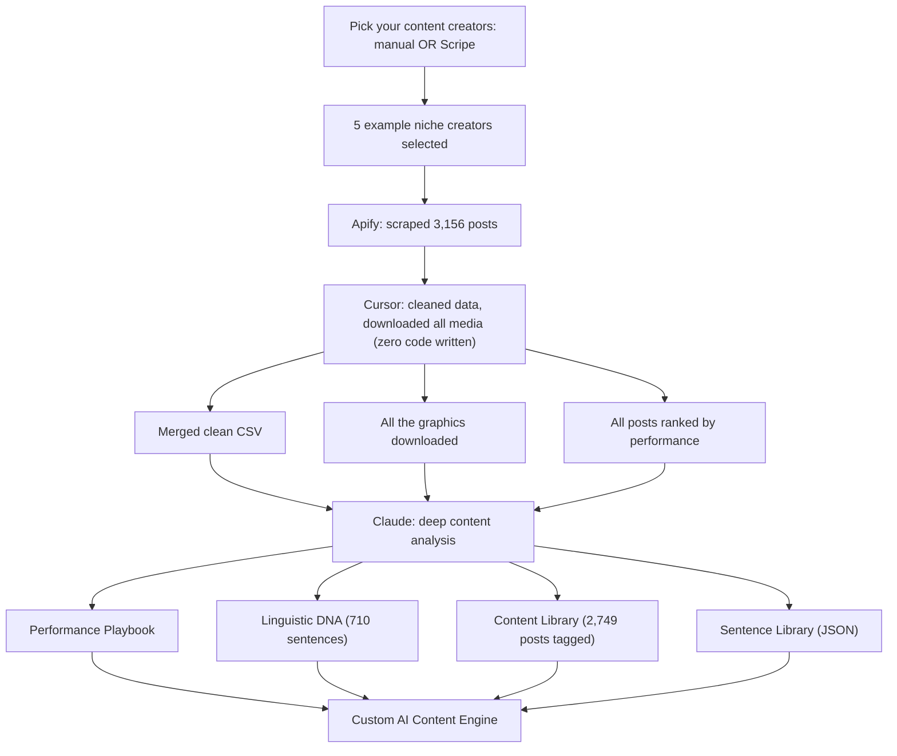

# Data-Trained AI Content Engine Playbook

**What this shows:** How to build a custom AI content engine trained on real high-performing posts: pick top niche creators, scrape their posts, clean the data, run a deep content analysis, and assemble the outputs into a reusable engine.

## Detail notes

| Step | Tool | What happens | Annotations |
|---|---|---|---|
| 1. Pick creators | Manual selection OR Scripe | Choose the top creators in your niche whose content you want to learn from | Diagram shows 5 example creators (individual names omitted) |
| 2. Scrape | Apify | Scrape the creators' posts | "Scraped 3,156 posts" |
| 3. Clean | Cursor | Clean the data and download all media | Callout: "Zero code written" |
| 4. Cleaned outputs | (from Cursor step) | Three artifacts produced | Merged clean CSV; all the graphics downloaded; all posts ranked by performance |
| 5. Analyze | Claude | Deep content analysis across the cleaned dataset | Produces four training assets |
| 6. Training assets | (from Claude step) | Performance Playbook; Linguistic DNA (710 sentences); Content Library (2,749 posts tagged); Sentence Library (JSON) | These become the knowledge base |
| 7. Assemble | Claude (engine runtime) | Combine all four assets into a Custom AI Content Engine | The engine generates new content grounded in real high-performing posts |

Key numbers: 3,156 posts scraped; 710 sentences in the Linguistic DNA; 2,749 posts tagged in the Content Library.

Key pattern: the engine is trained on evidence (ranked real posts) rather than generic prompting, and the cleaning step is done conversationally in an AI code editor with no code written by hand.
