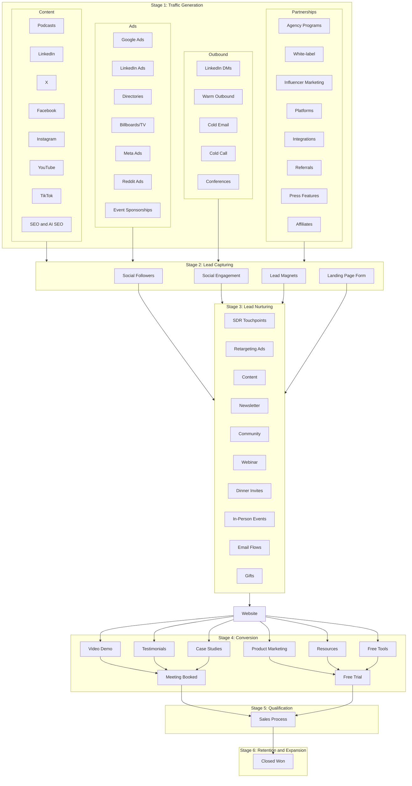

# GTM Flywheel: Traffic to Retention

**What this shows:** A six-stage GTM flywheel drawn as vertical swim-lanes: Traffic Generation (four channel families with sub-channels), Lead Capturing, Lead Nurturing, Conversion, Qualification, and Retention and Expansion. Every traffic sub-channel feeds the capture mechanisms, all nurturing paths converge on the website, and the funnel narrows to Meeting Booked or Free Trial, then Sales Process, then Closed Won.

## Detail notes

### Stage 1: Traffic Generation channel families

| Channel family | Sub-channels |
|---|---|
| Content | Podcasts, LinkedIn, X, Facebook, Instagram, YouTube, TikTok, SEO and AI SEO (Google) |
| Ads | Google Ads, LinkedIn Ads, Directories, Billboards/TV, Meta Ads, Reddit Ads, Event Sponsorships |
| Outbound | LinkedIn DMs, Warm Outbound (WhatsApp icon), Cold Email (Gmail icon), Cold Call (WhatsApp icon), Conferences |
| Partnerships | Agency Programs, White-label, Influencer Marketing, Platforms (Product Hunt icon), Integrations, Referrals, Press Features (TechCrunch icon), Affiliates |

Each channel family header also carries a small toolbar of production tools (design, AI, and editing tools by logo, including what appear to be Figma, ChatGPT, Canva, and CapCut for Content; most logos are too small to identify reliably).

### Stage 2: Lead Capturing

Four capture mechanisms sit between traffic and nurturing: Social Followers, Social Engagement, Lead Magnets, Landing Page Form. In the original layout every traffic sub-channel connects into this row (many-to-many), so the diagram above links the channel groups to the stage as a whole.

### Stage 3: Lead Nurturing approaches and tools

| Nurturing approach | Tool shown (by logo) |
|---|---|
| SDR Touchpoints | Gmail |
| Retargeting Ads | Meta |
| Content | LinkedIn |
| Newsletter | Beehiiv |
| Community | Slack |
| Webinar | Luma |
| Dinner Invites | WhatsApp |
| In-Person Events | (handshake icon, no tool) |
| Email Flows | Customer.io |
| Gifts | (logo not identifiable, gifting platform) |

### Stages 4-6: Conversion, Qualification, Retention

- Website is the central convergence point (all nurturing leads back to it).
- Conversion assets on the website: Video Demo, Testimonials, Case Studies, Product Marketing, Resources, Free Tools.
- Two conversion outcomes: Meeting Booked (scheduling tools shown by logo, not identifiable) and Free Trial (product-analytics tools shown by logo, not identifiable).
- Both outcomes feed a single Sales Process (Qualification stage), which ends in Closed Won (HubSpot and Salesforce logos), the Retention and Expansion stage.
