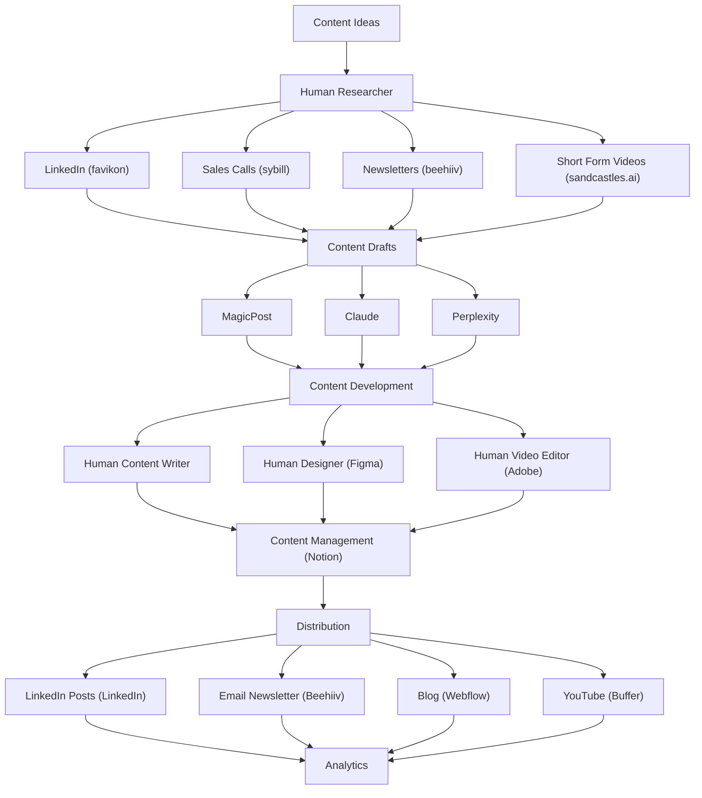

# Human-in-the-Loop Content Operating System

**What this shows:** A Human + AI content workflow that produces 100+ content pieces every month, moving from ideas through drafting, development, management, and distribution to analytics. Humans own research, writing, design, and video editing while AI tools handle drafting and repurposing at each stage.

## Detail notes

Headline claim on the diagram: "100+ content pieces every month".

| Stage | Owner | Sub-components | Tools |
|---|---|---|---|
| Content Ideas | Shared | Entry point of the system | (none shown) |
| Research | Human (Human Researcher) | LinkedIn, Sales Calls, Newsletters, Short Form Videos | favikon (LinkedIn), sybill (Sales Calls), beehiiv (Newsletters), sandcastles.ai (Short Form Videos) |
| Content Drafts | AI | Drafting and repurposing from the research inputs | MagicPost, Claude, Perplexity |
| Content Development | Human | Human Content Writer, Human Designer, Human Video Editor | Figma (design), Adobe (video editing) |
| Content Management | Shared | Central content hub and pipeline tracking | Notion |
| Distribution | Shared | LinkedIn Posts, Email Newsletter, Blog, YouTube | LinkedIn, Beehiiv, Webflow, Buffer |
| Analytics | Shared | Performance feedback on all distributed channels | (none shown) |

Key pattern: humans sit at the top (research) and middle (writing, design, video) of the funnel while AI tools sit in the drafting layer between them; every distribution channel feeds a single analytics stage that closes the loop back to content ideas.
