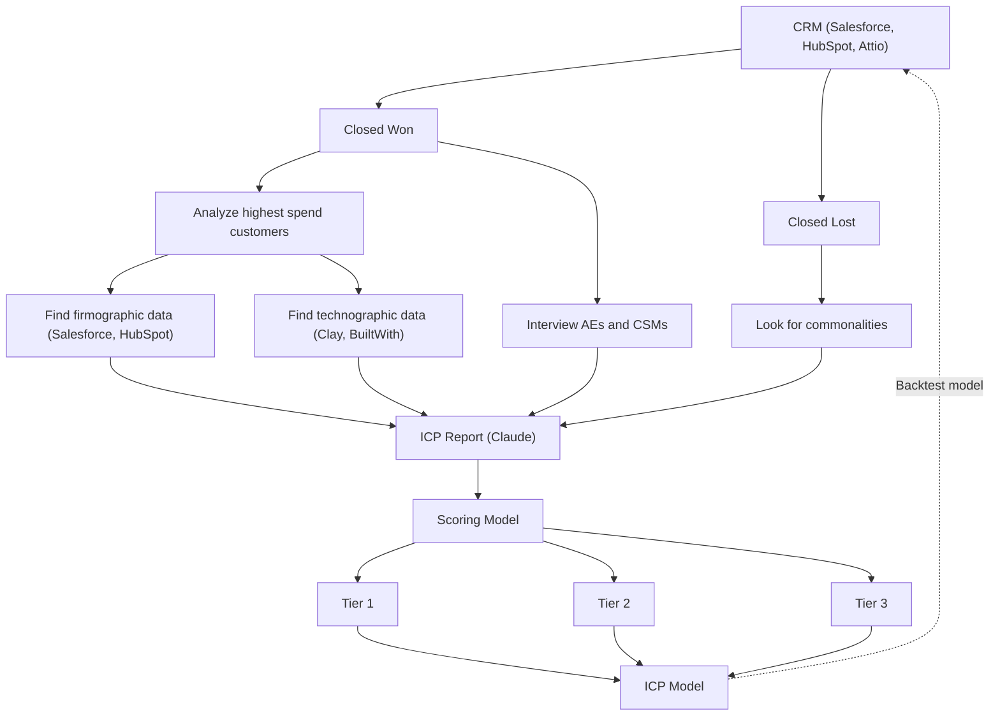

# ICP Modeling Flow with Backtest Loops

**What this shows:** How to build an ICP model from CRM data: analyze Closed Won and Closed Lost deals separately, enrich the winners with firmographic and technographic data, synthesize everything into an ICP report and scoring model, split accounts into three tiers, and continuously backtest the resulting ICP model against the CRM (refine loops drawn on both sides of the original diagram).

## Detail notes

- **CRM as the source of truth:** the flow starts and ends at the CRM (Salesforce, HubSpot, or Attio logos shown). The ICP is derived from actual deal outcomes, not assumptions.
- **Closed Won branch (two parallel tracks):**
  - Analyze highest spend customers, then enrich them with firmographic data (Salesforce, HubSpot) and technographic data (Clay, BuiltWith).
  - Interview AEs and CSMs for qualitative context that data alone misses.
- **Closed Lost branch:** look for commonalities among lost deals; anti-patterns are as important as win patterns for the report.
- **ICP Report:** all four inputs (firmographic data, technographic data, interviews, lost-deal commonalities) converge into a single report, generated with Claude in the original diagram.
- **Scoring Model and tiering:** the report is operationalized as a scoring model that assigns every account to Tier 1, Tier 2, or Tier 3. The three tiers together constitute the ICP Model.
- **Backtest loops (refine):** the original diagram draws dashed "Backtest model" loops on both the left and right side, from the final ICP Model back to the CRM. Meaning: periodically re-score historical won/lost deals with the current model; if the model would have missed real wins or prioritized real losses, revise the report and scoring weights. The ICP is a living model, not a one-time document.
