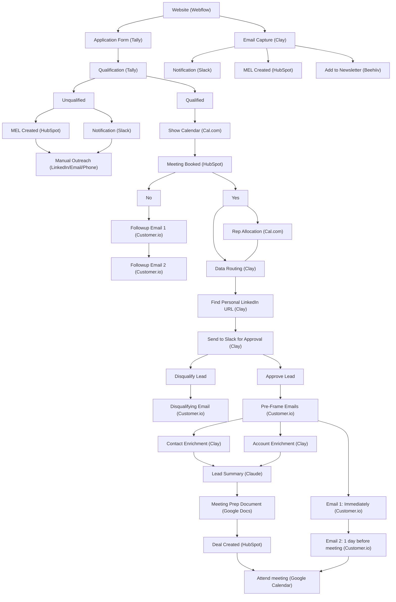

# Inbound Orchestration: Zero-Leakage Pipeline

**What this shows:** An end-to-end inbound pipeline with no leakage points: every website visitor either books a meeting, enters manual outreach, gets follow-up emails, or lands in the newsletter. Qualified leads flow through calendar booking, human lead approval in Slack, enrichment, AI-generated meeting prep, and CRM deal creation before the meeting happens. Each step names the tool that executes it.

## Detail notes

### Branch-by-branch logic

- **Form capture (primary path):** Website (Webflow) hosts an Application Form (Tally) whose answers drive Qualification (also Tally, form-logic based).
- **Unqualified leads are not dropped:** an MEL (marketing engaged lead) record is created in HubSpot and a Slack notification fires; the lead is worked via Manual Outreach across LinkedIn, email, or phone.
- **Qualified leads self-book:** calendar shown via Cal.com; the booking outcome is tracked as Meeting Booked in HubSpot.
  - **No-show on booking (did not book):** two follow-up emails via Customer.io.
  - **Booked:** Cal.com handles Rep Allocation while Clay routes the data.
- **Human-in-the-loop approval:** Clay finds the personal LinkedIn URL, then sends the lead to Slack for approval.
  - **Disqualify Lead:** a disqualifying email is sent via Customer.io (explicit rejection, not silence).
  - **Approve Lead:** pre-frame email sequence starts via Customer.io: Email 1 immediately, Email 2 one day before the meeting.
- **Meeting prep flow (parallel to pre-frame emails):** Contact Enrichment and Account Enrichment (both Clay) feed a Lead Summary generated by Claude, which becomes a Meeting Prep Document in Google Docs; a Deal is created in HubSpot, and everything converges on Attend meeting (Google Calendar).
- **Email capture (secondary path):** visitors who do not apply are captured by Clay, which triggers a Slack notification, creates an MEL in HubSpot, and adds the contact to the newsletter (Beehiiv).

### Tool roster

| Function | Tool |
|---|---|
| Website | Webflow |
| Forms and qualification logic | Tally |
| Scheduling and rep allocation | Cal.com |
| CRM (MEL, Meeting Booked, Deal) | HubSpot |
| Internal alerts and lead approval | Slack |
| Data routing, enrichment, LinkedIn lookup, email capture | Clay |
| Lifecycle and follow-up emails | Customer.io |
| Newsletter | Beehiiv |
| AI lead summary | Claude |
| Meeting prep document | Google Docs |
| Meeting | Google Calendar |
