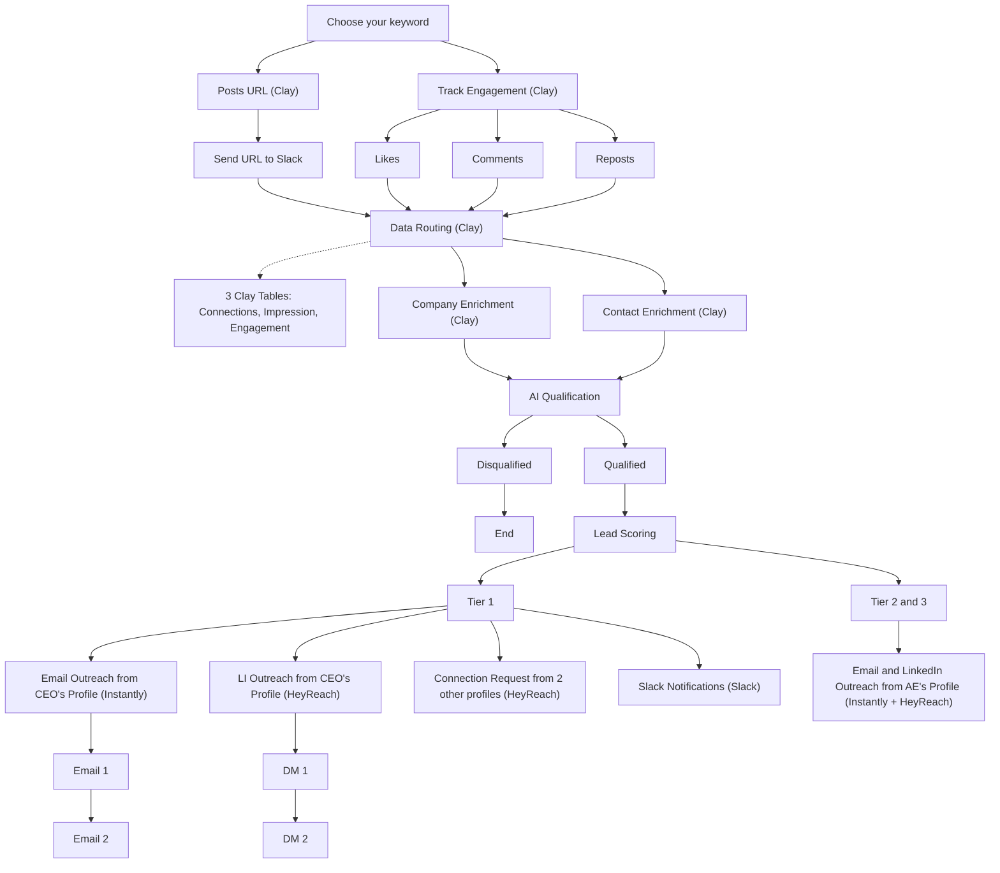

# LinkedIn Brand Mentions Outbound Playbook

**What this shows:** A signal-based outbound workflow that monitors LinkedIn posts mentioning a chosen brand keyword, captures both the posts and the people engaging with them (likes, comments, reposts), enriches and AI-qualifies them in Clay, and routes qualified leads into tiered multi-channel outreach.

**Pattern:** Signal capture, enrich, AI qualify, tier score, tier routing (Tier 1 vs Tier 2 and 3). Unique signal source: LinkedIn posts mentioning your brand keyword plus the engagers on those posts.

## Detail notes
- Two parallel capture branches from the keyword: one grabs the post URLs themselves (and pushes each URL to Slack for team visibility), the other tracks engagement on those posts split by Likes, Comments, and Reposts.
- Data routing consolidates everything into 3 Clay tables labeled Connections, Impression, and Engagement (one row per signal).
- Enrichment runs in parallel: company enrichment and contact enrichment, both in Clay.
- Disqualified leads hit an explicit End state; only Qualified leads proceed to lead scoring.
- Tier 1 gets the highest-touch treatment: email sent from the CEO's profile (Instantly), LinkedIn DMs from the CEO's profile (HeyReach), connection requests from 2 additional profiles (HeyReach), and a Slack notification to the team. Sequences are short: Email 1 then Email 2, DM 1 then DM 2.
- Tier 2 and Tier 3 are merged into a single lower-touch path: email and LinkedIn outreach sent from an AE's profile instead of the CEO's (Instantly + HeyReach).
- Deviations from the shared skeleton: no Findymail or BetterContact step is shown (enrichment is Clay only), Tier 1 uses executive-profile automated outreach plus Slack alert rather than cold calling plus manual LinkedIn, and Tiers 2 and 3 are collapsed into one branch differentiated by sender (AE vs CEO).
