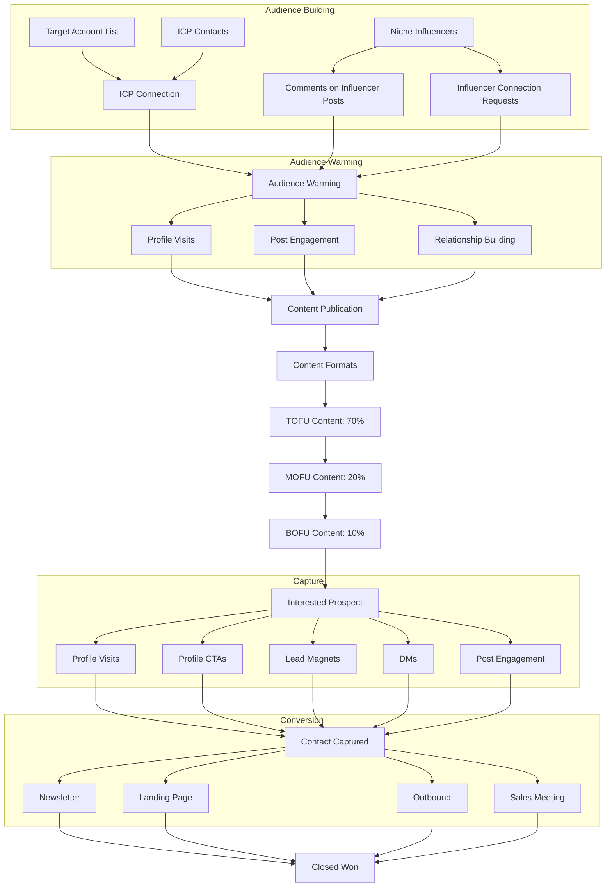

# LinkedIn Social Selling Funnel

**What this shows:** A full-funnel LinkedIn social selling system: build and warm an ICP audience, publish content in a 70/20/10 TOFU/MOFU/BOFU mix, capture interested prospects, and convert them through newsletter, landing page, outbound, or sales meetings to Closed Won.

## Detail notes

### Tactics per funnel stage

| Stage | Tactics and components |
|---|---|
| Audience Building | Target Account List and ICP Contacts feed ICP Connection requests; Niche Influencers are worked via Comments on Influencer Posts and Influencer Connection Requests |
| Audience Warming | Profile Visits, Post Engagement, Relationship Building (warm the audience before and alongside publishing) |
| Content Publication | Runs continuously after warming; branches into content formats by funnel depth |
| TOFU Content (70% of content mix) | Thought Leadership, Educational, Giveaways, Carousels, Storytelling |
| MOFU Content (20% of content mix) | Demos, How-tos, Frameworks, Playbooks, Webinars |
| BOFU Content (10% of content mix) | Case Studies, Testimonials, Product Marketing, Product Launches, Promotions |
| Capture | Interested prospects are captured via Profile Visits, Profile CTAs, Lead Magnets, DMs, Post Engagement |
| Conversion | Contact Captured routes to Newsletter, Landing Page, Outbound, or Sales Meeting |
| Retention and Expansion | Closed Won is the entry point to retention and expansion |

### Key ratios and principles

- **Content mix is 70/20/10:** 70% TOFU, 20% MOFU, 10% BOFU. Most content should build audience, not pitch.
- **Two audience-building tracks run in parallel:** direct ICP connections (from a target account list) and influencer-audience borrowing (comments and connection requests on niche influencer posts).
- **Warming precedes selling:** profile visits, post engagement, and relationship building happen before capture attempts.
- **Capture is multi-surface:** the profile itself (visits, CTAs), content (post engagement, lead magnets), and direct messages all feed Contact Captured.
- **Four conversion paths:** newsletter (nurture), landing page (self-serve), outbound (sales-initiated), sales meeting (direct), all converging on Closed Won.
