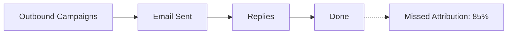
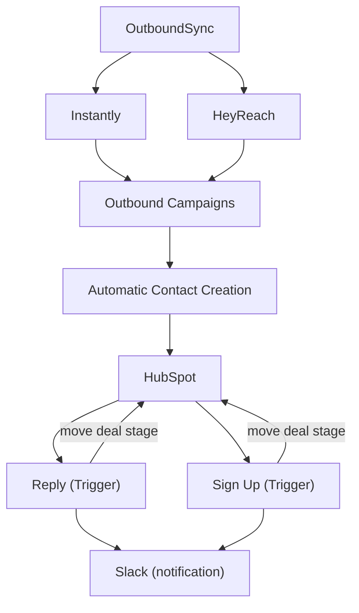

# Outbound Attribution Workflow

**What this shows:** The contrast between traditional outbound tracking (which stops at replies and misses 85% of attribution) and a complete attribution workflow that syncs sequencer activity into the CRM, creates contacts automatically, and moves deal stages on Reply and Sign Up triggers.

## Diagram 1: Traditional Tracking (the broken pattern)

## Diagram 2: Complete Attribution Workflow

## Detail notes

- **Traditional tracking problem:** the workflow ends at "Replies" with no CRM handoff. Result: 85% missed attribution. Outbound-sourced revenue gets credited to other channels (or nothing).
- **Complete workflow components:**
  - **OutboundSync** sits between the sequencers and the CRM, syncing campaign activity from both email (Instantly) and LinkedIn (HeyReach) channels.
  - **Automatic Contact Creation:** every prospect touched by an outbound campaign is created as a contact in HubSpot, so later conversions can be traced back to the campaign.
  - **Two attribution checkpoints, both configured as triggers in HubSpot:**
    - **Reply** trigger: a positive reply moves the deal stage and fires a Slack notification.
    - **Sign Up** trigger: a product sign-up moves the deal stage and fires a Slack notification.
  - **Slack** is the shared notification endpoint for both triggers, giving the team real-time visibility into outbound-sourced conversions.
- **Key principle:** attribution requires closing the loop from sequencer to CRM to conversion event. Tracking sends and replies alone is not attribution.
