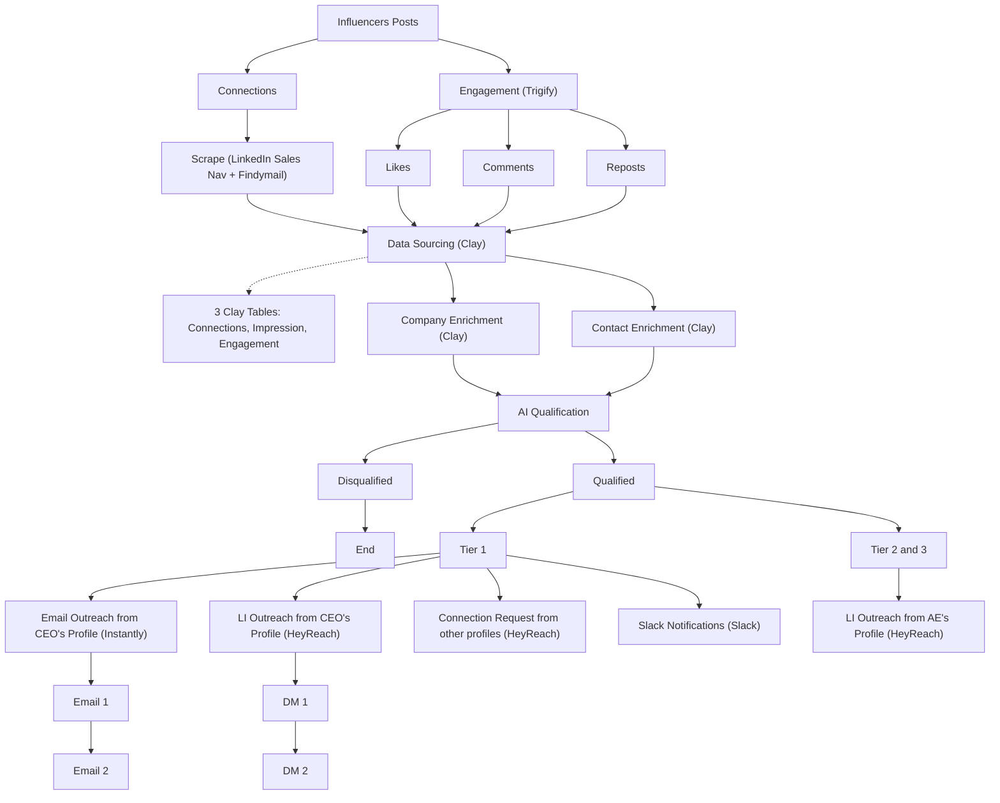

# Scrape Influencers' LinkedIn Engagement Playbook

**What this shows:** An outbound workflow that harvests two audiences around industry influencers: their LinkedIn connections (scraped via Sales Navigator) and the people engaging with their posts (likes, comments, reposts, tracked via Trigify), then enriches, AI-qualifies, and routes them into tiered multi-channel outreach.

**Pattern:** Signal capture, enrich, AI qualify, tier routing (Tier 1 vs Tier 2 and 3). Unique signal source: influencer post engagement plus influencer connection lists.

## Detail notes
- Two capture branches off the influencer's posts: the Connections branch scrapes the influencer's network via LinkedIn Sales Navigator with Findymail for email discovery; the Engagement branch uses Trigify to track engagers, split into Likes, Comments, and Reposts.
- Data sourcing consolidates into 3 Clay tables labeled Connections, Impression, and Engagement (one row per signal).
- Company enrichment and contact enrichment run in Clay before AI qualification; Disqualified leads hit an explicit End state.
- Tier 1 treatment: email from the CEO's profile (Instantly, Email 1 then Email 2), LinkedIn DMs from the CEO's profile (HeyReach, DM 1 then DM 2), connection requests from other team profiles (HeyReach), and Slack notifications for the team.
- Tier 2 and Tier 3 are merged into one lower-touch branch: LinkedIn outreach only, sent from an AE's profile via HeyReach (no email step shown for this branch).
- Deviations from the shared skeleton: no explicit Lead Scoring node is drawn between qualification and tier routing (tiering follows AI qualification directly), Findymail appears at the scrape stage rather than as a mid-funnel waterfall, BetterContact does not appear, and the Tier 2 and 3 branch is LinkedIn-only rather than auto email.
