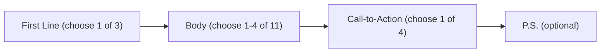

# Cold Outreach Message Framework

**What this shows:** A modular reference card for assembling a cold outreach message from four building blocks: one First Line, one to four Body components, one Call-to-Action, and an optional P.S. line. Every component below is a named building block with guidance on what it does.

## Message assembly order

## First Line (choose 1)

| Component | Description |
|---|---|
| Relevancy | Reason for reaching out to them specifically. |
| Observation | Signal or trigger. |
| Recency | Event or news. |

## Body (choose 1-4)

| Component | Description |
|---|---|
| Problem statement | Twist the knife with comparisons or stats. |
| Dream outcome | Calculate how they reach their ideal state. |
| Poke the bear | Question or statement around a pain point. |
| Case study | Successful outcomes from similar clients. |
| Problem-solution | Present solution with the problem. |
| Personal touch | Personalised video or voice note. |
| Social proof | Quantifiable results or name drop. |
| Value | Make money, save money, or save time. |
| Story | Tell a story to make your point. |
| Resource | Relevant guide or report. |
| Offer | Valuable way you can help. |

## Call-to-Action (choose 1)

| Component | Description |
|---|---|
| Soft CTA | Is solving {{problem}} a priority right now? |
| Resource CTA | Would you want to see the report? |
| Hard CTA | Open to a chat about this? |
| Colleague ask | Or is {{colleague name}} the right person to speak to about this? |

## P.S. (optional)

| Component | Description |
|---|---|
| P.S. line | Everyone reads these, it's a free line. |

## Detail notes

- Selection rules printed on the card: First Line "Choose 1", Body "Choose 1-4", Call-to-Action "Choose 1", P.S. "Optional".
- The card's subtitle frames these as "building blocks to a winning message": mix and match components rather than writing from scratch.
- The CTA examples use template variables ({{problem}}, {{colleague name}}) meant to be filled per prospect.
- Total inventory: 3 first-line types, 11 body components, 4 CTA types, 1 optional P.S., so a complete message is 3 to 6 modular blocks long.
