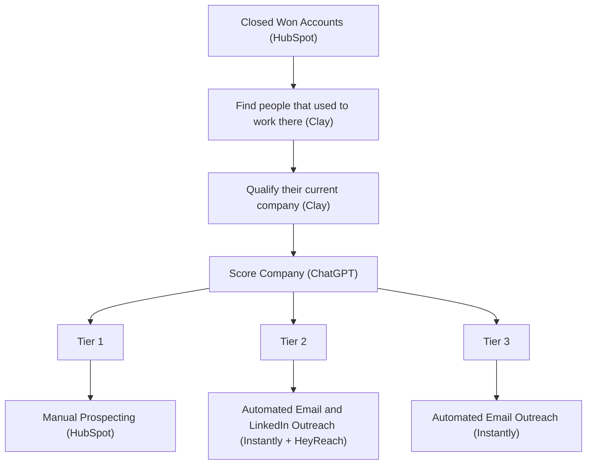

# The Customer Alumni Play

**What this shows:** An outbound workflow that mines closed-won accounts for former employees ("customer alumni") who have since moved to new companies, then qualifies and scores their current company before routing them into tiered outreach.

**Pattern:** Signal capture, enrich, AI qualify, tier score, 3-tier routing. Unique signal source: past employees of your closed-won customer accounts (pulled from HubSpot, alumni found via Clay).

## Detail notes
- Signal logic: someone who worked at a company that already bought from you carries the product knowledge and trust to their new employer. The play targets them at the new company.
- Tool mapping per step:

| Step | Tool |
|---|---|
| Source closed-won accounts | HubSpot |
| Find past employees of those accounts | Clay |
| Qualify the alumnus's current company | Clay |
| Score the company | ChatGPT |
| Tier 1 action | Manual Prospecting via HubSpot |
| Tier 2 action | Automated Email (Instantly) + Automated LinkedIn (HeyReach) |
| Tier 3 action | Automated Email only (Instantly) |

- Deviations from the shared skeleton: Tier 1 here is manual prospecting worked out of HubSpot (no cold calling or Slack alert step shown), and no dedicated contact-enrichment waterfall (Findymail, BetterContact) appears in this diagram.
