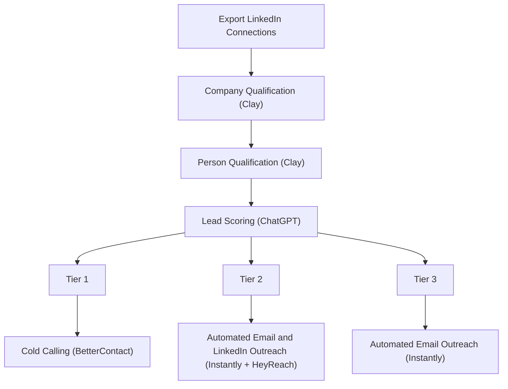

# The Founder Connections Playbook

**What this shows:** An outbound workflow that turns a founder's existing LinkedIn network into a prioritized pipeline: export all LinkedIn connections, qualify company then person in Clay, score with AI, and route into tiered outreach.

**Pattern:** Signal capture, enrich, AI qualify, tier score, 3-tier routing. Unique signal source: the founder's exported LinkedIn connections list (warm 1st-degree network).

## Detail notes
- Qualification is two-stage: qualify the company first, then the person, both in Clay. Disqualifying at the company level first saves person-level enrichment credits.
- Tool mapping per step:

| Step | Tool |
|---|---|
| Signal source | LinkedIn connections export (native LinkedIn CSV export) |
| Company qualification | Clay |
| Person qualification | Clay |
| Lead scoring | ChatGPT |
| Tier 1 action | Cold calling, phone numbers enriched via BetterContact |
| Tier 2 action | Automated Email (Instantly) + Automated LinkedIn (HeyReach) |
| Tier 3 action | Automated Email only (Instantly) |

- Tier 1 leads are 1st-degree connections, so outreach can lean on the existing relationship; cold calling is used because these already know the founder.
- Deviations from the shared skeleton: BetterContact appears here as the Tier 1 phone enrichment for cold calling (not as a mid-funnel email waterfall), and no Slack alert step is shown.
