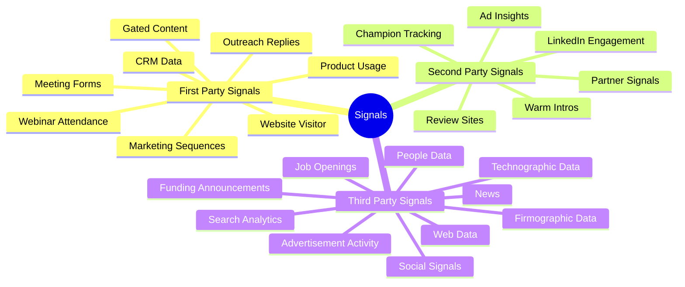

# Signal Taxonomy: First, Second, and Third Party Signals

**What this shows:** A radial three-ring taxonomy of buying signals, organized by how close the signal source is to your own systems: first-party (your own product, forms, CRM, and outreach data), second-party (shared or relationship-based data such as partners, champions, and LinkedIn engagement), and third-party (external market data such as funding, jobs, news, and technographics). Each signal type carries the detection tools shown in the original diagram.

## Detail notes

Each signal type is shown with three detection-tool logos. Tools listed below are the ones identifiable from the logos; where a logo could not be confidently matched to a product, it is marked as unidentified rather than guessed.

### First-party signals (inner ring)

| Signal type | Detection tools shown |
|---|---|
| Product Usage | Amplitude, Mixpanel, June (by logo) |
| Meeting Forms | Calendly, plus two form/scheduling tools (logos not identifiable) |
| Gated Content | Webflow, plus two tools (logos not identifiable) |
| Marketing Sequences | Customer.io, Kit (by logo), plus one tool (logo not identifiable) |
| CRM Data | HubSpot, Salesforce, Attio |
| Webinar Attendance | Luma, LinkedIn (Events), plus one tool (logo not identifiable) |
| Website Visitor | Warmly, RB2B, Vector |
| Outreach Replies | Three sequencer/reply tools (logos not identifiable) |

### Second-party signals (middle ring)

| Signal type | Detection tools shown |
|---|---|
| Partner Signals | Crossbeam, plus two partner-data tools (one likely Reveal by logo, unconfirmed) |
| Warm Intros | LinkedIn, plus two network-mapping tools (logos not identifiable) |
| Champion Tracking | Champify (crown logo), Clay, plus one tool (logo not identifiable) |
| LinkedIn Engagement | Clay, Trigify, Teamfluence |
| Ad Insights | Vector, plus two ad-intelligence tools (logos not identifiable) |
| Review Sites | G2, TrustRadius, plus one review platform (logo not identifiable) |

### Third-party signals (outer ring)

| Signal type | Detection tools shown |
|---|---|
| Funding Announcements | Crunchbase, plus two funding-data tools (logos not identifiable) |
| Search Analytics | Semrush, Ahrefs, plus one tool (logo not identifiable) |
| Technographic Data | BuiltWith, plus two technographic tools (logos not identifiable) |
| Job Openings | Clay, plus two job-data tools (logos not identifiable) |
| Firmographic Data | Three firmographic-data tools (logos not identifiable) |
| People Data | Clay, plus two people-data tools (logos not identifiable) |
| News | Clay, Google News, plus one tool (logo not identifiable) |
| Advertisement Activity | Three ad-library/ad-tracking tools (logos not identifiable) |
| Web Data | Clay, plus two web-scraping tools (logos not identifiable) |
| Social Signals | Clay, PhantomBuster (ghost logo), Trigify |

### How to read the rings

- **First-party** signals are the highest intent and cheapest to detect: the prospect is already interacting with your product, forms, emails, or website.
- **Second-party** signals come through relationships and shared ecosystems: partners, past champions, and engagement on your (or your team's) LinkedIn presence.
- **Third-party** signals are external market observations: they are the earliest and broadest, best used for account prioritization and trigger-based outreach rather than as standalone proof of intent.
