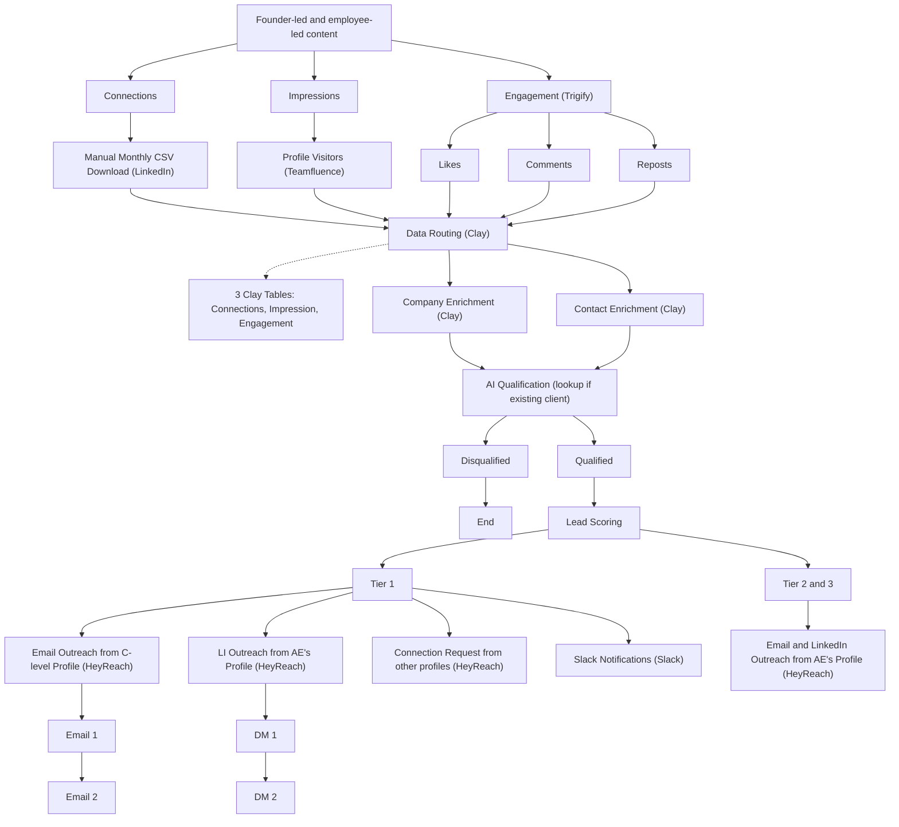

# Track Your Employees' LinkedIn Engagement Playbook

**What this shows:** An outbound workflow that captures three signal streams from your own team's founder-led and employee-led LinkedIn content (connections, profile impressions/visitors, and post engagement), consolidates them in Clay, AI-qualifies with an existing-client lookup, and routes into tiered multi-channel outreach.

**Pattern:** Signal capture, enrich, AI qualify, tier score, tier routing (Tier 1 vs Tier 2 and 3). Unique signal source: Connections + Impressions + Engagement harvested across all employee LinkedIn accounts.

## Detail notes
- Three parallel signal streams from team content:

| Stream | Capture method | Tool |
|---|---|---|
| Connections | Manual monthly CSV download | LinkedIn native export |
| Impressions | Profile visitors tracking | Teamfluence |
| Engagement | Likes, Comments, Reposts on posts | Trigify |

- Data routing consolidates into 3 Clay tables labeled Connections, Impression, and Engagement (one row per signal).
- AI Qualification carries an explicit annotation: "lookup if existing client", i.e. suppress or divert leads that are already customers before outreach.
- Disqualified leads hit an explicit End state; Qualified leads pass through Lead Scoring before tier routing.
- Tier 1 treatment: email outreach from a C-level profile, LinkedIn DMs from an AE's profile, connection requests from other team profiles, and Slack notifications. Sequences are short: Email 1 then Email 2, DM 1 then DM 2.
- Tier 2 and Tier 3 merge into one lower-touch branch: email and LinkedIn outreach from an AE's profile.
- Deviations from the shared skeleton: the diagram shows HeyReach as the tool label on all outreach boxes here, including the email steps (Instantly is not shown in this variant); no Findymail or BetterContact enrichment appears; and Tiers 2 and 3 are collapsed into one branch differentiated by sender seniority.
