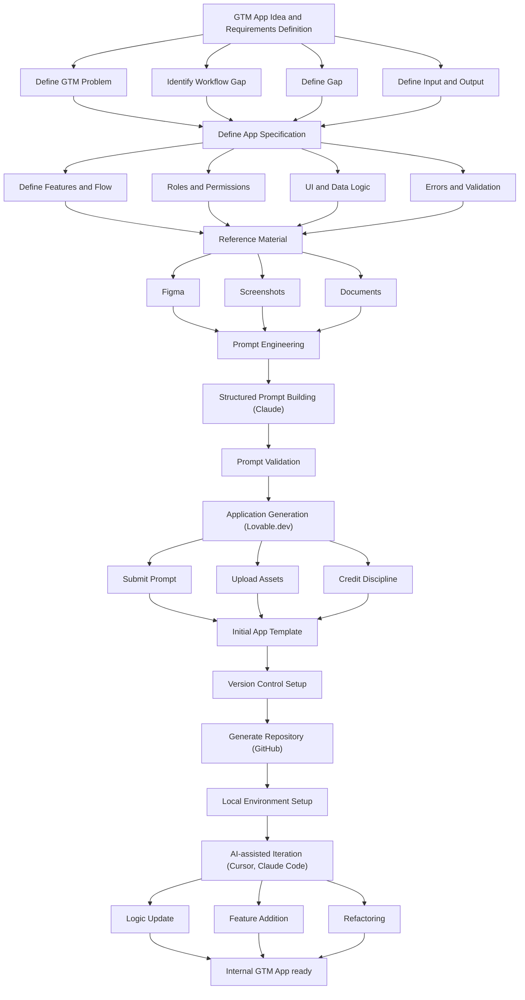

# Vibe Coding Playbook for GTM App Building

**What this shows:** A vertical workflow for building internal GTM tools without traditional coding: define the app idea and spec, gather reference material, engineer a structured prompt, generate an MVP in Lovable, set up version control, then iterate with AI coding assistants until the internal GTM app is ready.

## Detail notes

| Phase | Sub-steps | Tools |
|---|---|---|
| GTM App Idea and Requirements Definition | Define GTM Problem; Identify Workflow Gap; Define Gap; Define Input and Output | (none shown) |
| Define App Specification | Define Features and Flow; Roles and Permissions; UI and Data Logic; Errors and Validation | (none shown) |
| Reference Material | Collect design files, screenshots, and documents to ground the build | Figma, Screenshots, Documents |
| Prompt Engineering | Structured Prompt Building, then Prompt Validation before generating anything | Claude |
| Application Generation | Submit Prompt; Upload Assets; Credit Discipline (avoid wasting generation credits) | Lovable.dev |
| Initial App Template | First working MVP produced by the generator | Lovable.dev output |
| Version Control Setup | Generate Repository, then Local Environment Setup | GitHub |
| AI-assisted Iteration | Logic Update; Feature Addition; Refactoring | Cursor, Claude Code |
| Outcome | Internal GTM App ready | (end state) |

Key pattern: spec and reference material come before any prompting; the prompt is validated before generation; the MVP moves into version control before iteration, so AI-assisted changes (logic, features, refactors) happen against a repository rather than inside the no-code builder.

Legibility note: the third sub-step under the requirements phase renders as "Define Gap" in the source image; the exact wording of that one label is uncertain due to small type.
