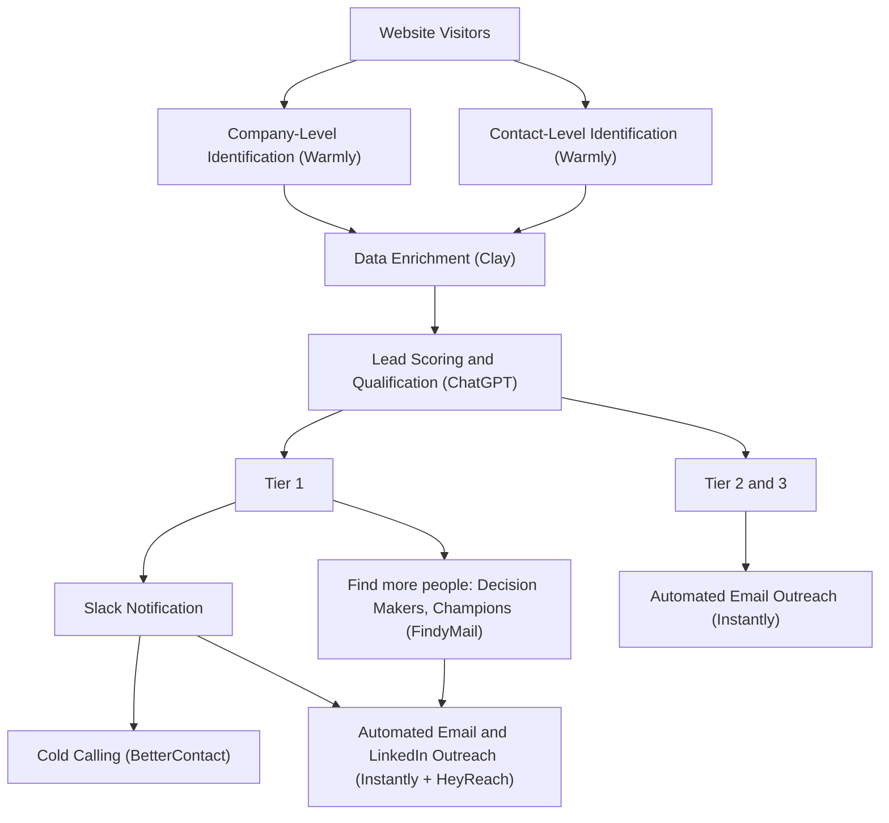

# Website Visitor De-Anonymization Outbound Workflow

**What this shows:** An end-to-end workflow that turns anonymous website visitors into tiered outbound targets: identify the company and contact (Warmly), enrich (Clay), score and qualify (ChatGPT), then route Tier 1 to high-touch multi-channel outreach and Tier 2 and 3 to automated email.

## Detail notes

- **Identification (Warmly):** runs at two levels in parallel:
  - Company-Level Identification: which account is visiting.
  - Contact-Level Identification: which person is visiting.
- **Data Enrichment (Clay):** enrich the identified company and contact with firmographic and contact data before scoring.
- **Lead Scoring and Qualification (ChatGPT):** an AI step scores and qualifies each identified visitor, splitting the flow into tiers.
- **Tier 1 (best-fit accounts), high-touch treatment:**
  - Slack Notification to alert the team in real time.
  - Find more people at the account: Decision Makers and Champions, using FindyMail for email discovery.
  - Cold Calling, with phone numbers via BetterContact.
  - Automated Email and LinkedIn Outreach via Instantly (email) and HeyReach (LinkedIn).
- **Tier 2 and 3 (lower-fit accounts), low-touch treatment:**
  - Automated Email Outreach only, via Instantly.
- **Tool roster:** Warmly (de-anonymization), Clay (enrichment), ChatGPT (scoring), FindyMail (contact discovery), BetterContact (phone waterfall), Instantly (email sequencer), HeyReach (LinkedIn sequencer), Slack (alerts).
